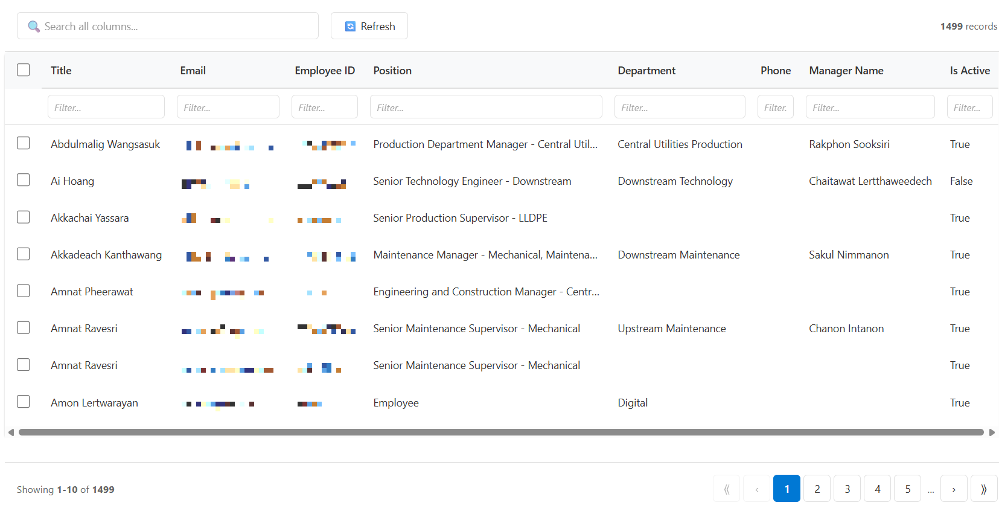
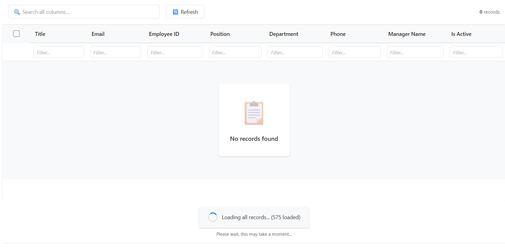
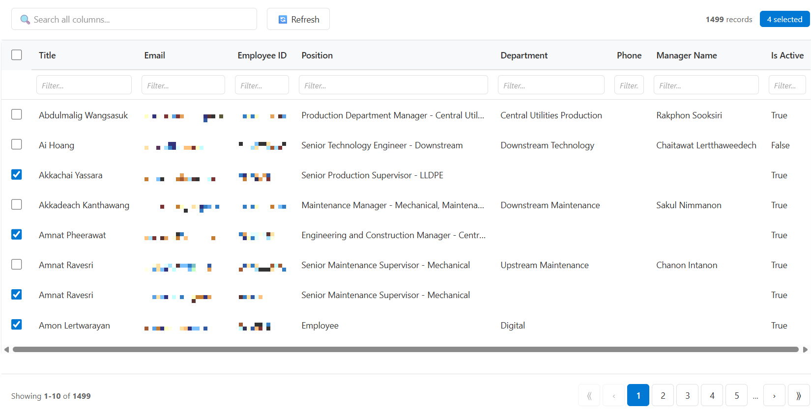

# PCF DataTable

The Advanced DataTable PCF Control transforms the default Power Apps grid experience into a powerful, user-friendly data management interface. Unlike standard grids, this control automatically loads all available records, provides instant client-side filtering and sorting, and offers a polished, modern UI that works seamlessly across all Power Apps environments.

---

## Download

| | Link |
|--|------|
| **Latest release (ZIP)** | [pcf-datatable.zip](https://github.com/user-attachments/files/25926404/Solution.zip) |
| **All releases** | [github.com/luckytvn/PCF-DataTable/releases](https://github.com/luckytvn/PCF-DataTable/releases) |

---

## Screenshots

### DataTable default view

### Loading

### Selection

---
